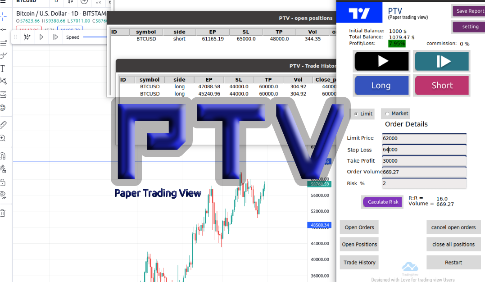

# PTV (paper-trading-view)
`paper_trading_view` is project written for simulate trade in Demo it use trading view when bar reply is enable.  
as you know trading view doesn't have paper trading on bar reply and we prepare it for you in this project, `PTV` provide you a demo account for upgrade your skill in trading 

# Why?
this feature does not exist in [TradingView](https://www.tradingview.com/) . you can use it for train , backtest youre strategies 


# How It Works


# Quick installation (for windows users)


1- [Download](https://github.com/xibalbas/paper_trading_view/raw/master/executable_app/executable_win32_v1.0.1.rar) project

you can easily download executable version of this project from this [Link](https://github.com/xibalbas/paper_trading_view/raw/master/executable_app/executable_win32_v1.0.1.rar)

2- make sure you installed chrome browser on your device . go to [tradingview.com](tradingview.com) and login into your account . 

3- Extract `.rar` file and Run `ptv.exe`

[Quick installation tutorial video](https://youtu.be/zW962uAD4TU)

`Notice: Every time you want to run ptv.exe make sure chrome is closed before.`


# Features
- [x] **Based on Python 3.7+**: For botting on any operating system - Windows, macOS and Linux.
- [x] **work with TradingView**: For bar reply and getting price we use trading view.
- [x] **Limit/Market orders**: you can place a `Limit` or `Market` order in 2 side "long", "Short" .
- [x] **SL/TP set**: you can set stop loss and take profit for your market or limit order .
- [x] **see Open orders**: you can see list of open orders.
- [x] **see Open positions**: you can see list of open positions.
- [x] **see trade history**: you can see list of trade history.
- [x] **Next/Play/Pause in bar reply**: you can use this items in `PTV` and when price is changing open positions and open orders will be check. 
- [x] **initial setting**: you can set your initial money / commission.
- [x] **profit/loss of account**: your total profit / loss calculate when your position close.
- [x] **save report**: you can save your trade history in a csv file.


# Requirements

* Python 3.7+ (install it from [website](https://www.python.org/downloads/))
* Chrome driver (Download it from [website](https://chromedriver.chromium.org/downloads))
* selenium ,tkinter

# Getting start
make sure you installed [python3.7+](https://www.python.org/downloads/)
```bash
# you can clone project from github
git clone https://github.com/xibalbas/paper_trading_view.git
cd paper_trading_view/src

# or
# you can download project zip file and extract 
https://github.com/xibalbas/paper_trading_view/archive/refs/heads/master.zip
cd paper_trading_view-master/src

```
#### make an enviorment
```bash
sudo apt-get install python3-tk
pip install virtualenv
python -m venv venv

# Linux Users
source venv/bin/activate

# Windows Users
.\venv\Scripts\activate.bat

```
#### install requirements packages
```bash
pip install -r requirements.txt
```
#### Run
```bash
python app.py
```

# Contributing
Contributions are very welcome. There are a number of requirements:
* See Issues tab, and feel free to submit your own issues
* Add PRs if you discover a solution to an existing issue
* The code should be Pep8 compliant.
* Comments are required for every class and function and they should be a clear description.
* At least one broad test case and a set of unit tests must be provided for every function.
* Avoid very pythonic construction

# License
`PTV` is freely available under the MIT [license](https://github.com/xibalbas/paper_trading_view/blob/master/LICENSE).
